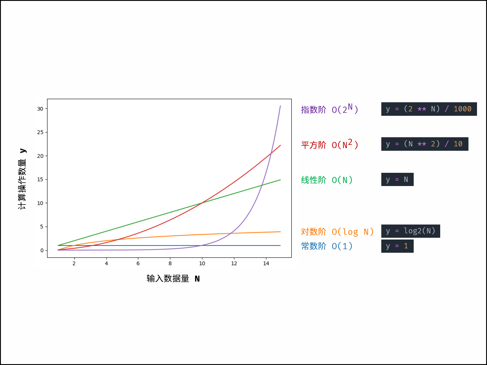
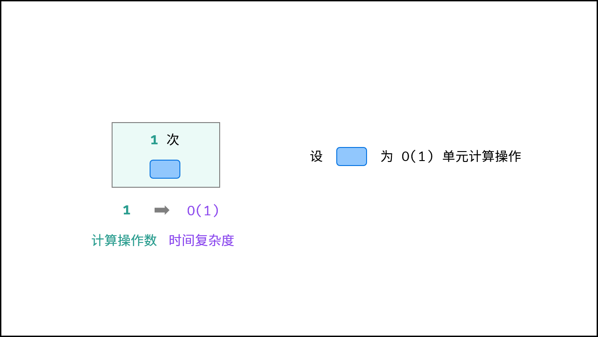
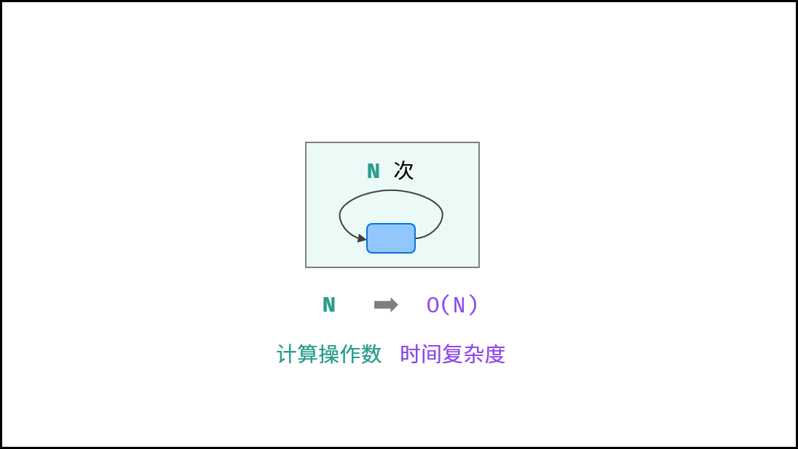
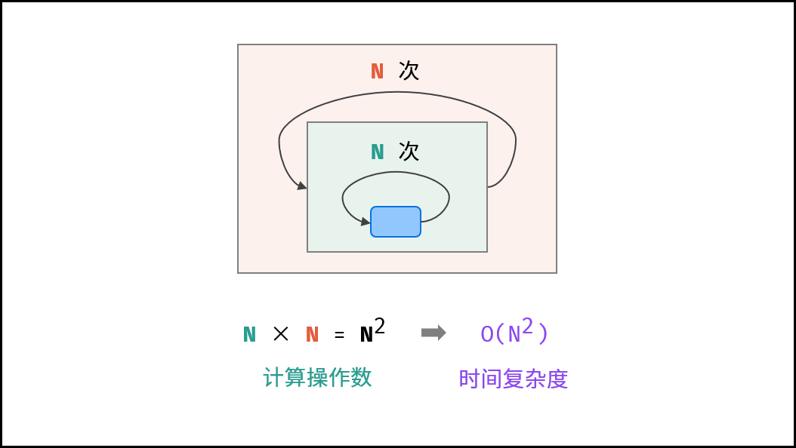
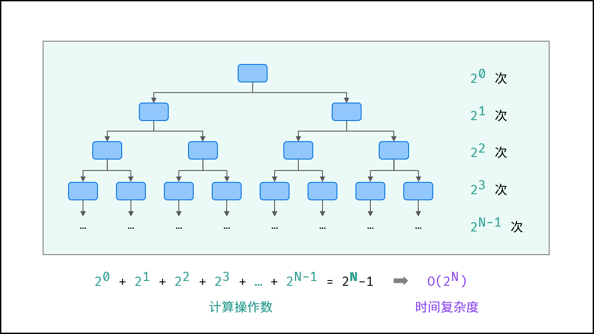
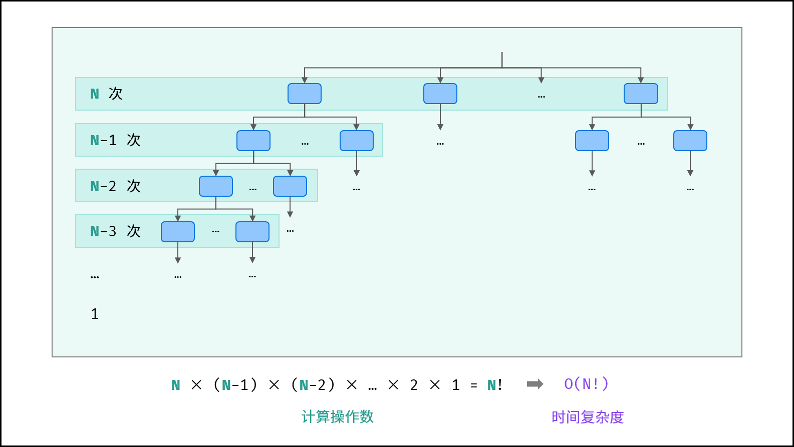

# 概述

## 时间复杂度

根据定义，时间复杂度指输入数据大小为 NN 时，算法运行所需花费的时间。需要注意：

- 统计的是算法的「计算操作数量」，而不是「运行的绝对时间」。计算操作数量和运行绝对时间呈正相关关系，并不相等。算法运行时间受到「编程语言 、计算机处理器速度、运行环境」等多种因素影响。例如，同样的算法使用 Python 或 C++ 实现、使用 CPU 或 GPU 、使用本地 IDE 或力扣平台提交，运行时间都不同。
- 体现的是计算操作随数据大小 NN 变化时的变化情况。假设算法运行总共需要「 11 次操作」、「 100100 次操作」，此两情况的时间复杂度都为常数级 O(1)O(1) ；需要「 NN 次操作」、「 100N100N 次操作」的时间复杂度都为 O(N)O(N) 。

### 符号表示

根据输入数据的特点，时间复杂度具有「最差」、「平均」、「最佳」三种情况，分别使用 OO , Θ , Ω 三种符号表示。以下借助一个查找算法的示例题目帮助理解。

> **题目**： 输入长度为 NN 的整数数组 nums ，判断此数组中是否有数字 77 ，若有则返回 true ，否则返回 false。
>
> **解题算法**： 线性查找，即遍历整个数组，遇到 77 则返回 true 。
>
> 代码：
> ```typescript
> function findSeven(nums:number[]):boolean{
>    for(var i = 0 ; i < nums.length ; i++){
>        if(nums[i] == 7){
>            return true
>        }
>    }
>   return false
> }
> ```

- 最佳情况 \Omega(1)Ω(1) ： nums = [7, a, b, c, ...] ，即当数组首个数字为 77 时，无论 nums 有多少元素，线性查找的循环次数都为 11 次；
- 最差情况 O(N)O(N) ： nums = [a, b, c, ...] 且 nums 中所有数字都不为 77 ，此时线性查找会遍历整个数组，循环 NN 次；
- 平均情况 \ThetaΘ ： 需要考虑输入数据的分布情况，计算所有数据情况下的平均时间复杂度；例如本题目，需要考虑数组长度、数组元素的取值范围等；

> 大 OO 是最常使用的时间复杂度评价渐进符号，下文示例与本题目解析皆使用 OO 。

### 常见种类

根据从小到大排列，常见的算法时间复杂度主要有:

O(1) < O(\log N) < O(N) < O(N\log N) < O(N^2) < O(2^N) < O(N!)



### 示例解析

对于以下所有示例，设输入数据大小为 NN ，计算操作数量为 countcount 。图中每个「蓝色方块」代表一个单元计算操作。

#### 常数 O(1)O(1) ：

运行次数与 NN 大小呈常数关系，即不随输入数据大小 NN 的变化而变化。

```typescript
function algorithm(N:number):number{
    const a:number = 1
    const b:number = 2
    const x:number = a * b + N

    return 1
}
```

对于以下代码，无论 aa 取多大，都与输入数据大小 NN 无关，因此时间复杂度仍为 O(1)O(1) 。

```typescript
function algorithm(N:number):number{
    let count:number = 0
    const a:number = 10000

    for(var i:number = 0 ; i < a ; i++){
        count++
    }
    return count
}
```



#### 线性 O(N)O(N) ：

循环运行次数与 NN 大小呈线性关系，时间复杂度为 O(N)O(N) 。

```typescript
function algorithm(N:number):number{
    let count:number = 0
    for(var i = 0; i < N ; i++){
        count++
    }
    return count
}
```

对于以下代码，虽然是两层循环，但第二层与 NN 大小无关，因此整体仍与 NN 呈线性关系。

```typescript
function algorithm(N:number):number{
    let count:number = 0
    let a:number = 10000
    for(var i = 0; i < N ; i++){
        for(var j = 0; j < a ; j++){
            count++
        }
    }
    return count
}
```



#### 平方 O(N^2)O(N2) ：

两层循环相互独立，都与 NN 呈线性关系，因此总体与 NN 呈平方关系，时间复杂度为 O(N^2)O(N 2) 。

```typescript
function algorithm(N:number):number{
    let count:number = 0
    for(var i = 0 ; i < N ;i++){
        for(var j = 0 ; j < N ; j++){
            count++
        }
    }
    return count
}
```

以「冒泡排序」为例，其包含两层独立循环：

1. 第一层复杂度为 O(N)O(N) ；
2. ​第二层平均循环次数为 N/2 ,复杂度为 O(N)O(N) ，推导过程如下
O(N/2)=O(1/2)O(N)=O(1)O(N)=O(N)

因此，冒泡排序的总体时间复杂度为 O(N^2)，代码如下所示。

```typescript
function algorithm(nums:number[]):number[]{
    let N:number = nums.length
    for(var i = 0; i < N - 1; i++){
        for(var j = 0; j < N - 1; j++){
            if (nums[j] > nums[j + 1]) {
                var tmp = nums[j];
                nums[j] = nums[j + 1];
                nums[j + 1] = tmp;
            }
        }
    }
    return nums
}
```



#### 指数 O(2^N)O(2 ：

生物学科中的 “细胞分裂” 即是指数级增长。初始状态为 11 个细胞，分裂一轮后为 22 个，分裂两轮后为 44 个，……，分裂 NN 轮后有 2^N 个细胞。

算法中，指数阶常出现于递归，算法原理图与代码如下所示。

```typescript
function algorithm(N:number):number{
    if(N <= 0){
        return 1
    }
    let count_1:number = algorithm(N - 1)
    let count_2:number = algorithm(N - 1);
    return count_1 + count_2
}
```



#### 阶乘 O(N!)：

阶乘阶对应数学上常见的 “全排列” 。即给定 NN 个互不重复的元素，求其所有可能的排列方案，则方案数量为：

N × (N -1) × (N - 2) × … × 2 × 1 = N!

如下图与代码所示，阶乘常使用递归实现，算法原理：第一层分裂出 NN 个，第二层分裂出 N - 1N−1 个，…… ，直至到第 NN 层时终止并回溯。

```typescript
function algorithm(N:number):number{
    if(N <= 0){
        return 1
    }
    let count:number = 0
    for(var i = 0 ; i < N ; i++){
        count += algorithm(N - 1)
    }
    return count
}
```



#### 对数 O(logN)：

对数阶与指数阶相反，指数阶为 “每轮分裂出两倍的情况” ，而对数阶是 “每轮排除一半的情况” 。对数阶常出现于「二分法」、「分治」等算法中，体现着 “一分为二” 或 “一分为多” 的算法思想。

设循环次数为 mm ，则输入数据大小 NN 与 2 ^ m
呈线性关系，两边同时取 log2 对数，则得到循环次数 m 与 log2N 呈线性关系，即时间复杂度为 O(logN) 。

```typescript
function algorithm(N:number):number{
    let count = 0
    let i = N
    while(i > 1){
        i = i / 2
        count++
    }
    return count
}
```

如以下代码所示，对于不同 a 的取值，循环次数 m 与 log_aN 呈线性关系 ，时间复杂度为 O(log_aN) 。而无论底数 a 取值，时间复杂度都可记作 O(logN) ，根据对数换底公式的推导如下：

O(log_aN)= O(log_2N)/O(log_2a)=O(logN)

```typescript
function algorithm(N:number):number{
    let count:number = 0
    let i = N
    let a:number = 3
    while(i > 1){
        i = i / a
        count++
    }
    return count
}
```

>如下图所示，为二分查找的时间复杂度示意图，每次二分将搜索区间缩小一半。
